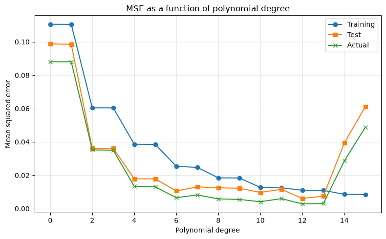
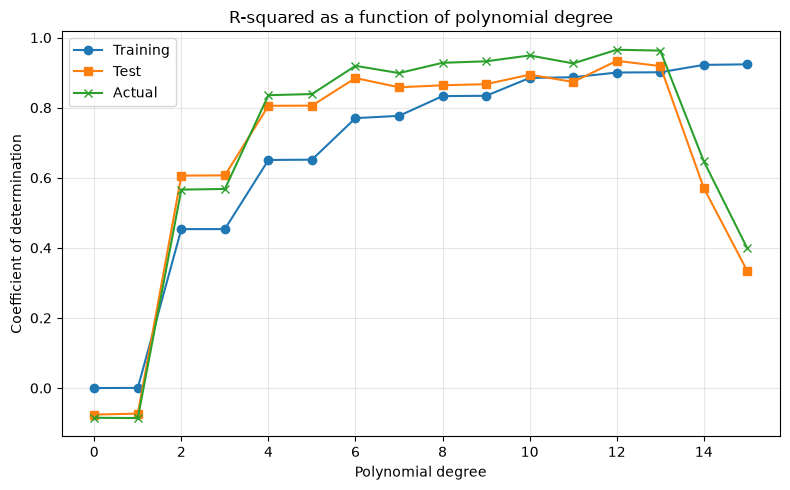
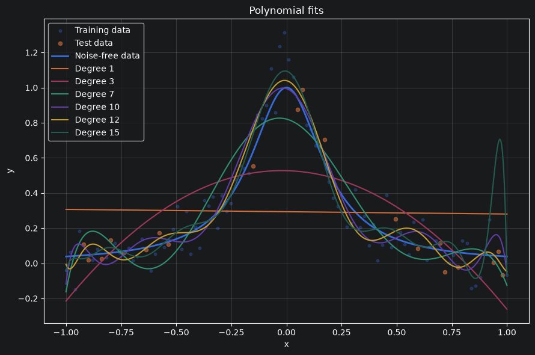
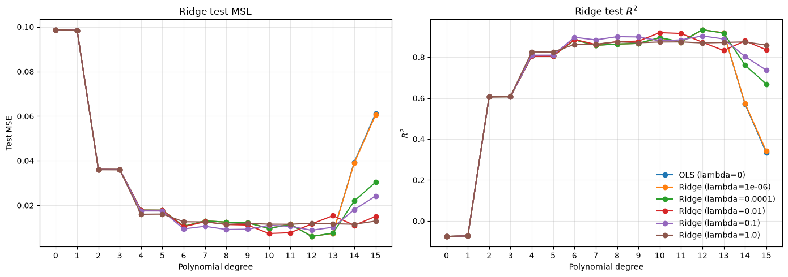
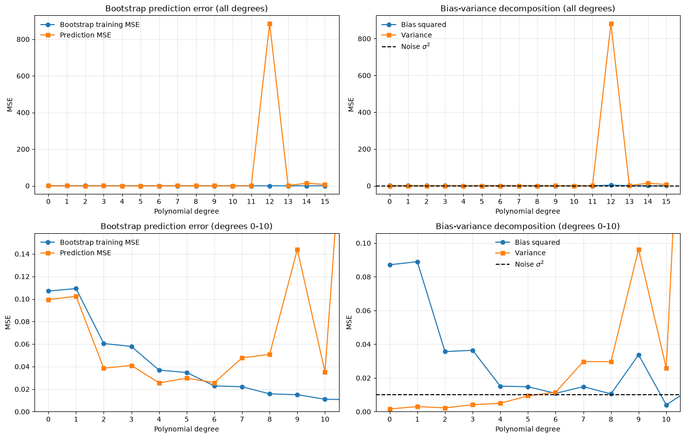
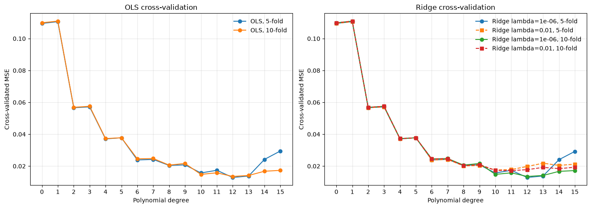
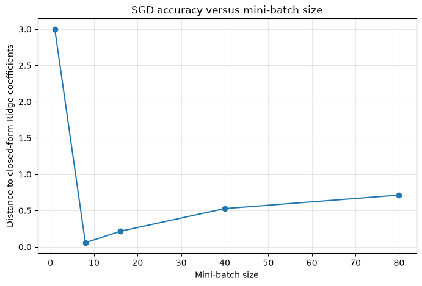
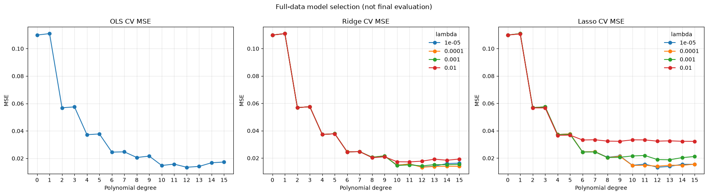
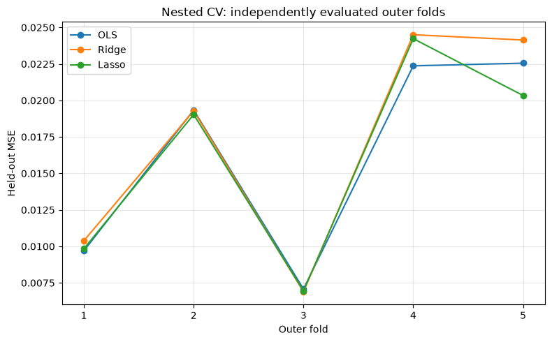

# Polynomial Regression for the Runge Function

**Author:** Katarzyna Anna Zubowicz  
**Course:** FYS-STK3155  
**Project:** Project 1  
**Github repository:** https://github.com/kazub-dev/fys-stk3155_proj1

## Abstract

In this project I studied polynomial regression for the Runge function

$$
f(x)=\frac{1}{1+25x^2}, \qquad x\in[-1,1],
$$

with additive Gaussian noise. I implemented ordinary least squares (OLS),
Ridge regression, bootstrap resampling, cross-validation, gradient-based
optimizers, Lasso regression, and stochastic gradient descent. The main data
set contained 100 equally spaced points, noise standard deviation
\(\sigma=0.1\), and polynomial degrees from 0 to 15. The data were split into
80% training and 20% test data.

For the fixed exploratory split, OLS had its lowest printed test MSE at degree
12, with test MSE \(0.006079\) and test \(R^2=0.933768\). Ridge achieved a
slightly lower test MSE of \(0.006055\) with \(\lambda=10^{-4}\) and degree 12.  
In full-data 10-fold cross-validation, the selected OLS model had degree 12
and model-selection MSE \(0.01352575\), while the best Ridge model had
\(\lambda=10^{-4}\), degree 12, and model-selection MSE \(0.01330909\). The best
Lasso model in that selection comparison had \(\lambda=10^{-5}\), degree 12, and
model-selection MSE \(0.01335312\). These minima are not independent final
performance estimates: the same folds selected the hyperparameters. Final
evaluation instead uses nested cross-validation, with five outer evaluation
folds and five inner selection folds. Its pooled held-out MSE was \(0.016207633\)
for OLS, \(0.017040405\) for Ridge, and \(0.016078834\) for Lasso. Lasso and
OLS were close in this evaluation, without establishing a robust advantage
for either. The Lasso comparison uses a solver with checked stationarity,
rather than the finite-budget proximal solver used for the separate
optimization exercise. The experiments also showed that increasing the
polynomial degree reduces training error but can increase test error, and that
regularization and resampling are useful for assessing this tradeoff.

## 1. Introduction

### 1.1 Motivation and problem

The purpose of this project was to study several supervised learning methods
and resampling techniques on a controlled regression problem. I used the Runge
function because it is smooth but difficult to approximate well with high-order
polynomials near the ends of the interval. This makes it suitable for
studying underfitting, overfitting, regularization, and the bias--variance
tradeoff.

The project required comparisons between OLS, Ridge, and Lasso regression,
together with bootstrap and cross-validation methods. I also investigated
gradient descent and several adaptive optimization methods, and compared their
solutions with the closed-form OLS and Ridge solutions.

### 1.2 Structure of the report

Section 2 introduces the regression models, error measures, resampling
methods, and optimization methods. Section 3 describes the data generation,
scaling, splitting, and experimental setup. Section 4 describes the
implementation and numerical checks. Section 5 presents the stored numerical
results and their interpretation. Section 6 discusses limitations and critical
points, and Section 7 summarizes the main conclusions.

## 2. Theory and formalism

### 2.1 Data model and polynomial design matrix

I generated observations according to

$$
y_i=f(x_i)+\epsilon_i,\qquad \epsilon_i\sim\mathcal{N}(0,\sigma^2).
$$

The polynomial model of degree \(p\) was represented by

$$
\tilde y_i=\sum_{j=0}^{p}\theta_j x_i^j
  =\mathbf{x}_i\mathbf{\theta}.
$$

The corresponding design matrix contains the columns
\(1,x,x^2,\ldots,x^p\). In the implementation, the input coordinate was
standardized using the training data before constructing this matrix.

### 2.2 MSE and \(R^2\)

I used the mean squared error

$$
\operatorname{MSE}(\mathbf y,\tilde{\mathbf y})
=\frac{1}{n}\sum_{i=0}^{n-1}(y_i-\tilde y_i)^2
$$

and the coefficient of determination

$$
R^2
=1-\frac{\sum_i(y_i-\tilde y_i)^2}
{\sum_i(y_i-\bar y)^2}.
$$

The MSE was used to select models in the cross-validation experiments.

### 2.3 OLS regression

For OLS, the cost function is the mean squared error. The coefficient estimate
can be computed with the pseudoinverse:

$$
\hat{\mathbf\theta}
=\mathbf X^+\mathbf y.
$$

I used `numpy.linalg.pinv` rather than explicitly inverting
\(\mathbf X^T\mathbf X\). This is a numerically safer implementation of
the same least-squares solution for the design matrices used here.

### 2.4 Ridge regression

Ridge regression adds an \(\ell_2\) penalty to the coefficients. The
implementation used a penalty matrix whose intercept entry was zero, so that
the intercept was not penalized:

$$
\hat{\mathbf\theta}_{\mathrm{Ridge}}
=
(\mathbf X^T\mathbf X+\lambda\mathbf P)^+
\mathbf X^T\mathbf y.
$$

Here \(\lambda\geq0\), and \(\mathbf P\) is the identity matrix except for
its first diagonal entry, which is zero. In the singular-value interpretation,
regularization reduces the contribution from modes with small singular values.

### 2.5 Bias--variance decomposition and bootstrap

For data generated as \(y=f(x)+ \epsilon\), the expected prediction error can
be decomposed as

$$
\mathbb E[(y-\tilde y)^2]
=\operatorname{Bias}^2[\tilde y]
+\operatorname{Var}[\tilde y]
+\sigma^2.
$$

The bias term measures the squared difference between the true function and
the average model prediction. The variance term measures the variation of
model predictions over different training sets. The final term is the noise
variance.

I estimated these quantities with bootstrap resampling of the training data.
For each degree, I generated 200 bootstrap samples, fitted an OLS polynomial
to each sample, and evaluated predictions on a grid. The stored implementation
uses the known noise-free Runge function for the bias calculation, so the bias
estimate is not obtained by replacing the unknown function with noisy
observations.

### 2.6 Cross-validation

I implemented shuffled 5-fold and 10-fold cross-validation. For every fold,
the scaling parameters were calculated from the fold's training data and then
applied to the corresponding validation data. This avoids allowing validation
data to influence preprocessing.

Cross-validation was used to estimate the MSE as a function of polynomial
degree for OLS and as a function of degree and \(\lambda\) for Ridge. A final
10-fold model-selection comparison also included Lasso. These CV minima are
selection scores, not independent final evaluation scores.

For final evaluation, I used nested cross-validation with five shuffled outer
folds and five shuffled inner folds. Each outer training set selects the
degree and penalty using only its inner folds. Scaling is fitted separately
on each inner training fold, and then refitted on the complete outer training
set before predicting its untouched outer fold. Final MSE and \(R^2\) use
the pooled outer-fold predictions, so every observation is evaluated exactly
once by a model that did not train or tune on it. Hyperparameters may differ
between outer folds; this evaluates the selection procedure rather than one
fixed model. The candidate grid is fixed before the outer evaluation.

### 2.7 Gradient descent and automatic differentiation

For OLS, the analytical gradient used was

$$
\nabla_{\mathbf\theta}C
=\frac{2}{n}\mathbf X^T
(\mathbf X\mathbf\theta-\mathbf y).
$$

For Ridge, the gradient contains the corresponding penalty contribution for
the non-intercept coefficients. Gradient descent updates the parameters as

$$
\mathbf\theta_{k+1}
=\mathbf\theta_k-\eta\nabla C(\mathbf\theta_k).
$$

I also used JAX to calculate gradients automatically. Automatic
differentiation applies the chain rule to the operations in the cost function;
it is not symbolic differentiation and it is not finite-difference
approximation.

The plain gradient-descent stability limit is connected to the largest
eigenvalue of the Hessian. For the OLS Hessian, the implementation calculated
\(\eta_{\max}=2/\lambda_{\max}(H)\).

### 2.8 Momentum, AdaGrad, RMSprop, and Adam

I compared ordinary gradient descent with momentum, AdaGrad, RMSprop, and
Adam. These methods modify the update by using previous gradients or
coordinate-dependent learning-rate factors. Their purpose in this project was
to compare convergence speed and accuracy relative to the closed-form Ridge
solution.

### 2.9 Lasso and proximal updates

Lasso adds an \(\ell_1\) penalty. Because the absolute-value function is not
differentiable at zero, I used a proximal soft-thresholding update for the
non-intercept coefficients:

$$
\operatorname{soft}(z,t)
=\operatorname{sign}(z)\max(|z|-t,0).
$$

The derivative returned by JAX for \(|\theta|\) at zero was `1.0`. This is a
valid member of the subgradient interval \([-1,1]\), although it is not the
only valid subgradient at zero.

The final model-selection comparison instead uses scikit-learn's `LassoLars`
solver. Its objective matches \(\operatorname{MSE}+\lambda
\sum_{j>0}|\theta_j|\): `LassoLars` minimizes
\(\operatorname{MSE}/2+\alpha\sum_j|\theta_j|\), so \(\alpha=\lambda/2\).
The constant column is omitted from its inputs and an unpenalized intercept
is fitted separately. Degree zero uses the training-response mean. A
first-order optimality (KKT) residual is checked for every fit; a failure
stops evaluation rather than silently including an unconverged estimate.

## 3. Data and experimental setup

The default configuration in the solution notebook was:

| Quantity | Value |
|---|---:|
| Number of points | 100 |
| Domain | \([-1,1]\) |
| Noise standard deviation | 0.1 |
| Test fraction | 0.2 |
| Maximum polynomial degree | 15 |
| Default seed | 2026 |

The points were equally spaced in \([-1,1]\). The noisy response was generated
with a NumPy random generator. I used `train_test_split` with
`random_state=2026`.

Before constructing the design matrices, I standardized \(x\) using the mean
and standard deviation calculated from the training data only. The same
training-data transformation was applied to the test data. This prevents the
test inputs from determining the transformation.

The experiments varied the following:

- Polynomial degree from 0 to 15.
- Number of data points: 20, 50, 150, 250, and 500.
- Noise standard deviation: 0.0, 0.01, 0.05, 0.2, and 0.5.
- Ten random seeds for a test-error variability plot.
- Ridge penalties \(0\), \(10^{-6}\), \(10^{-4}\), \(10^{-2}\), \(0.1\), and
  \(1.0\).
- Five-fold and ten-fold cross-validation.
- 200 bootstrap resamples.
- Mini-batch sizes 1, 8, 16, 40, and the complete training set for the SGD
  experiment.

The final cross-validation used degrees 0--15 and Lasso/Ridge penalties
\(10^{-5}\), \(10^{-4}\), \(10^{-3}\), and \(10^{-2}\).

The fixed 80/20 split is used only for exploration of degree and penalty
effects. Its lowest test scores are not presented as independent final
generalization estimates because these curves were inspected during model
development. The outer nested-CV scores are kept separate from these
exploratory results and from the full-data CV selection minima.

For SGD, every batch targets the same objective,
\(\operatorname{MSE}+\lambda\sum_{j>0}\theta_j^2/n_{\mathrm{train}}\).
The data gradient is averaged over the current batch, while the penalty
gradient always uses the full training-set size, including for a shorter
last batch. Lasso uses the distinct objective
\(\operatorname{MSE}+\lambda\sum_{j>0}|\theta_j|\); consequently, equal
numerical penalty values do not imply equal regularization strength across
Ridge and Lasso. Lasso model-selection fits use `LassoLars`, with a checked maximum KKT
residual of \(10^{-6}\). This is distinct from the proximal-gradient
optimization demonstration in Section 5.6.

## 4. Implementation, testing, and numerical checks

The notebook defines reusable functions for data generation, scaling, design
matrix construction, prediction, MSE, \(R^2\), OLS, Ridge, bootstrap,
cross-validation, gradient descent, proximal Lasso, and mini-batch SGD.
Results are plotted with Matplotlib, and numerical summaries are printed for
the main comparisons.

The OLS solver uses the pseudoinverse. The Ridge solver uses the penalized
normal equations and excludes the intercept from the penalty. The bootstrap
and cross-validation routines refit models for each resampled or folded
training set. The model-selection Lasso fit uses a separate converged solver;
the proximal solver remains as a pedagogical optimizer experiment.

I checked the gradient implementations against JAX. The source uses the same
normalized Ridge penalty convention in the closed-form solver, cost function,
analytical gradient, automatic-differentiation gradient, and iterative
optimizers. All code cells were executed sequentially in a fresh kernel using
the project's `.venv/bin/python` on 5 October 2026. All report figures were
exported from those new notebook outputs, rather than copied from previous
runs. The reproducible command is
`.venv/bin/python scripts/run_notebook.py`; dependency installation and
environment setup are documented in `README.md`.

For plain gradient descent on degree 5, the reported coefficient errors
relative to the closed-form solutions were \(1.087\times10^{-7}\) for OLS and
\(1.082\times10^{-7}\) for Ridge, after 18012 and 17924 iterations,
respectively.

The notebook reports \(\eta_{\max}=0.8937721839600539\) for OLS and
\(\eta_{\max}=0.8937623265903589\) for Ridge for the gradient-descent test
problem.

## 5. Results and analysis

### 5.1 OLS as a function of degree

The fixed-split OLS results were:

| Degree | Train MSE | Test MSE | Train \(R^2\) | Test \(R^2\) |
|---:|---:|---:|---:|---:|
| 0 | 0.110524 | 0.098739 | 0.000000 | -0.075725 |
| 1 | 0.110470 | 0.098486 | 0.000485 | -0.072965 |
| 2 | 0.060390 | 0.036142 | 0.453600 | 0.606251 |
| 3 | 0.060388 | 0.036081 | 0.453618 | 0.606914 |
| 4 | 0.038588 | 0.017857 | 0.650861 | 0.805457 |
| 5 | 0.038487 | 0.017814 | 0.651774 | 0.805919 |
| 6 | 0.025386 | 0.010585 | 0.770313 | 0.884679 |
| 7 | 0.024668 | 0.013008 | 0.776812 | 0.858278 |
| 8 | 0.018443 | 0.012482 | 0.833134 | 0.864016 |
| 9 | 0.018342 | 0.012189 | 0.834041 | 0.867209 |
| 10 | 0.012719 | 0.009696 | 0.884925 | 0.894367 |
| 11 | 0.012494 | 0.011605 | 0.886953 | 0.873566 |
| 12 | 0.011010 | 0.006079 | 0.900384 | 0.933768 |
| 13 | 0.010920 | 0.007445 | 0.901194 | 0.918892 |
| 14 | 0.008591 | 0.039395 | 0.922273 | 0.570807 |
| 15 | 0.008423 | 0.061169 | 0.923791 | 0.333587 |

Training MSE decreases almost monotonically as the degree increases. Test MSE
does not: it is lowest at degree 12 and then rises strongly at degrees 14 and 15. 
The corresponding decline in test \(R^2\) shows the effect of
overfitting. In contrast, degrees 0 and 1 underfit the curved Runge function,
as indicated by their negative test \(R^2\) values.

The notebook includes plots of MSE and \(R^2\) versus degree, fitted
polynomials for degrees 1, 3, 7, 10, 12, and 15, and the OLS parameters as
the degree increases. Figures 1--3 show the stored OLS plots for the fixed
split, with \(n=100\), \(\sigma=0.1\), and seed 2026.

*Figure 1: Stored OLS training and test MSE curves for the fixed 80/20 split.
The additional “Actual” curve is evaluated against the noiseless Runge values
on the test points.*

*Figure 2: Stored OLS training and test \(R^2\) curves for the fixed split.*

*Figure 3: Stored polynomial fits for selected degrees, together with the
training and test observations and the noise-free Runge function.*

### 5.2 Ridge regression

The best fixed-split test results for each penalty were:

| \(\lambda\) | Best degree | Test MSE | Test \(R^2\) |
|---:|---:|---:|---:|
| \(0.0\) | 12 | 0.006079 | 0.933768 |
| \(10^{-6}\) | 12 | 0.006079 | 0.933775 |
| \(10^{-4}\) | 12 | 0.006055 | 0.934032 |
| \(10^{-2}\) | 10 | 0.007368 | 0.919731 |
| \(0.1\) | 12 | 0.008835 | 0.903742 |
| \(1.0\) | 8 | 0.011464 | 0.875109 |

The very small Ridge penalty \(10^{-4}\) slightly improved the best test MSE
relative to OLS. Larger penalties changed the best degree and produced larger
minimum test errors in this experiment. The stored notebook also plots the
singular-mode shrinkage factor

$$
\frac{s^2}{s^2+\lambda},
$$

for the degree-15 design matrix. This illustrates *uniformly penalized*
Ridge, where smaller singular values receive greater shrinkage. It is not
the exact singular-mode decomposition of the fitted Ridge model, because
that model leaves the intercept unpenalized.

*Figure 4: Stored Ridge test MSE and test \(R^2\) curves as functions of
polynomial degree for the listed penalty values.*

### 5.3 Bootstrap and bias--variance results

The bootstrap experiment used 200 training-set resamples for every polynomial
degree. The implementation calculates held-out test MSE on `x_test` and
`y_test`, while storing the noiseless-grid error separately as `grid_mse`.
After rerunning the affected cells, the lowest held-out bootstrap prediction
MSE occurred at degree 4.

The notebook plots bootstrap training MSE and prediction MSE, together with
the estimated squared bias, variance, and noise level. These curves illustrate
the bias--variance tradeoff, including the sensitivity of high-degree fits to
resampling; they do not establish that bias always decreases monotonically.
The large degree-12 spike is dominated by estimated variance, emphasizing
how sensitive some bootstrap fits are to the particular resampled inputs.
The exact numerical values of every plotted
bootstrap curve were not printed in the notebook, so I do not report
additional point values here.

*Figure 5: Regenerated bootstrap training/held-out prediction curves and
estimated bias--variance components, evaluated at the same held-out inputs.
The prediction MSE averages the errors of individual bootstrap fits; it is
not the error of an ensemble-averaged prediction. The lower panels show
degrees 0--10 at a readable scale while the upper panels retain the
degree-12 spike.*

Bootstrap and CV need not select the same degree. Here bootstrap selects
degree 4, whereas the full-data 5-fold and 10-fold OLS CV curves select degree 12.
Bootstrap repeatedly samples the 80 training observations with
replacement, so each resample contains fewer distinct inputs and repeated
copies of the same noisy responses. High-degree polynomials can therefore
be much more variable than when fitted to the distinct observations in a
CV training fold. Bootstrap also always evaluates on the same 20 held-out
points, whereas CV rotates its validation points across all 100 observations.
Its metric averages errors over the resampled models rather than evaluating
one fit per fold. These differences in training information, evaluation
points, and estimated quantity explain why agreement is not guaranteed;
the difference alone does not show that either method is incorrect.
The noiseless-grid MSE equals estimated squared bias plus variance for these
predictions, while noisy held-out MSE need not equal that sum plus
\(\sigma^2\) exactly for one fixed realization of test noise.

### 5.4 Cross-validation

The stored cross-validation results gave:

| Cross-validation | OLS best degree | Ridge best \(\lambda\) | Ridge best degree |
|---|---:|---:|---:|
| 5-fold | 12 | \(10^{-6}\) | 12 |
| 10-fold | 12 | \(10^{-4}\) | 12 |

Both fold choices selected degree 12 for OLS and Ridge. The difference between
the preferred Ridge penalties shows that the penalty selection is somewhat
sensitive to the fold partition for this data set, even though the selected
degree is stable.

*Figure 6: Stored 5-fold and 10-fold cross-validation curves for OLS and the
shown Ridge penalty values.*

### 5.5 Gradient descent and adaptive optimizers

For the Ridge degree-5 problem, the stored optimizer comparison was:

| Method | Iterations | Coefficient error |
|---|---:|---:|
| Plain | 20000 | \(8.754\times10^{-2}\) |
| Momentum | 19282 | \(1.904\times10^{-6}\) |
| AdaGrad | 6962 | \(6.052\times10^{-7}\) |
| RMSprop | 20000 | \(1.225\times10^{-2}\) |
| Adam | 692 | \(2.393\times10^{-8}\) |

In this particular parameter setting, Adam reached the smallest coefficient
error in the fewest iterations. AdaGrad and momentum also approached the
closed-form solution closely. Plain gradient descent and RMSprop reached the
iteration limit before meeting the chosen stopping criterion, so their larger
errors should not be interpreted as evidence that their limiting solutions
are different from the Ridge solution. An additional Adam learning-rate sweep
was rerun and is stored in the notebook.

### 5.6 Lasso

The proximal Lasso experiment used \(\lambda=10^{-3}\). The stored output
reported:

| Quantity | Value |
|---|---:|
| Iterations | 18304 |
| Nonzero non-intercept coefficients | 5 |
| Training MSE | 0.0385160062400922 |
| JAX derivative of `abs` at zero | 1.0 |

All five non-intercept coefficients of this degree-5 fit remain nonzero at
the reported threshold. Thus this run does not demonstrate coefficient
elimination, although soft-thresholding can produce sparse solutions at
other penalties. The Lasso result
cannot be compared directly to the OLS degree-5 training MSE without also
considering the penalty and the different fitted coefficients.

### 5.7 Stochastic gradient descent

The stored SGD experiment used Ridge with \(\lambda=10^{-2}\), batch size 16,
1000 epochs, and learning rate 0.005. It reported:

| Quantity | Value |
|---|---:|
| Coefficient error relative to closed-form Ridge | 0.05306945122151651 |
| Training MSE | 0.03866552069616744 |

The corrected mini-batch implementation normalizes the penalty by all 80
training observations, not by the batch size. The previous batch-dependent
normalization strengthened the penalty for smaller batches and changed the
objective being compared. All runs below now target the same closed-form
Ridge solution:

| Batch size | Epochs | Parameter updates | Coefficient error |
|---:|---:|---:|---:|
| 1 | 500 | 40000 | 2.999270740 |
| 8 | 500 | 5000 | 0.056874468 |
| 16 | 500 | 2500 | 0.214427401 |
| 40 | 500 | 1000 | 0.527203080 |
| 80 | 500 | 500 | 0.713527744 |

Batch size 8 has the smallest coefficient error for this seed, learning rate,
and epoch budget. Smaller batches make more updates per epoch, but batch size
1 still has the largest error: more updates do not guarantee greater accuracy
with a fixed learning rate and noisy gradients. This is an equal-epoch
comparison, not an equal-update or equal-runtime benchmark, and does not
establish a generally optimal batch size.

At batch size 16, the coefficient errors were \(0.7125\), \(0.2144\), and
\(0.05307\) for 100, 500, and 1000 epochs at learning rate \(0.005\), and
\(0.5274\) for 1000 epochs at learning rate \(0.001\). More epochs improved
accuracy in these runs, while the smaller learning rate needed more training
to approach the reference solution. Nonzero errors can reflect both incomplete
convergence and stochastic fluctuations; these runs do not establish different
limiting objectives.

*Figure 7: Regenerated SGD batch-size comparison at 500 epochs and learning
rate 0.005, with a consistent full-training-set Ridge penalty.*

### 5.8 Final OLS, Ridge, and Lasso comparison

The full-data model-selection comparison used 10-fold cross-validation and
the same generated data configuration with \(n=100\), \(\sigma=0.1\), and
seed 2026. Its minima are useful for choosing hyperparameters, but are not
independent estimates of final generalization performance:

| Method | Selected hyperparameters | Model-selection CV MSE |
|---|---|---:|
| OLS | Degree 12 | 0.01352575 |
| Ridge | \(\lambda=0.0001\), degree 12 | 0.01330909 |
| Lasso | \(\lambda=1e-05\), degree 12 | 0.01335312 |

Ridge gave a slightly lower selection MSE than OLS; Lasso's selection MSE
was also close. Every Lasso fit passed the \(10^{-6}\) KKT residual check;
the maximum full-data CV residual was \(1.795\times10^{-7}\).

*Figure 8: Regenerated full-data 10-fold model-selection MSE curves for OLS,
Ridge, and Lasso. These are not the final outer-fold evaluation results.*

The final evaluation instead used 5 outer folds and 5 inner folds for degree
and penalty selection. Outer predictions were pooled over all 100 observations:

| Method | Nested-CV held-out MSE | Pooled held-out \(R^2\) | Outer-fold MSE SD |
|---|---:|---:|---:|
| OLS | 0.016207633 | 0.849775045 | 0.007310267 |
| Ridge | 0.017040405 | 0.842056270 | 0.008039581 |
| Lasso | 0.016078834 | 0.850968857 | 0.007341601 |

OLS selected degrees 10, 12, 12, 10, and 14 across the five outer folds.
Ridge selected degrees 11, 12, 12, 10, and 15, with penalties \(10^{-3}\),
\(10^{-5}\), \(10^{-4}\), \(10^{-3}\), and \(10^{-5}\), respectively.
Lasso selected degrees 11, 12, 12, 10, and 15, with penalties \(10^{-4}\),
\(10^{-5}\), \(10^{-5}\), \(10^{-4}\), and \(10^{-5}\), respectively.
The largest inner-fold Lasso KKT residual was \(2.099\times10^{-7}\);
the largest selected outer-refit residual was \(8.341\times10^{-8}\).

Lasso has a slightly lower pooled MSE than OLS, and OLS slightly outperforms
Ridge here. These differences are small relative to variation between folds;
no statistically established superiority is claimed. The
fold SDs describe variability across this partition, not confidence intervals,
because the fitted training sets overlap. Unlike the earlier finite-budget
proximal comparison, these Lasso results use fits with checked stationarity.

*Figure 9: Regenerated held-out MSE for each outer fold. Degree and penalty
selection used only the corresponding outer training set's inner folds.*

## 6. Discussion and limitations

The results illustrate the central complexity tradeoff. Low-degree
polynomials have too little flexibility to represent the Runge function,
while very high-degree polynomials fit the training data increasingly well but
perform worse on held-out data. The best degree depends on how the error is
estimated: the fixed split and cross-validation both selected degree 12 for
the full-data OLS/Ridge selection comparisons, while the bootstrap
prediction-MSE curve selected degree 4. Nested CV selected different degrees
across outer folds, reflecting sensitivity to the available training data.
The bootstrap/CV difference is explained in Section 5.3.

Exploratory sample-size curves vary rather than improve monotonically:
the lowest fixed-split test MSEs are \(0.016193\) at \(n=20\),
\(0.005584\) at \(n=50\), \(0.012655\) at \(n=150\), \(0.014924\) at
\(n=250\), and \(0.011938\) at \(n=500\). Each sample size generates a
different grid and noise vector, so these single-run minima do not isolate
the effect of more observations. For the noise sweep, the lowest exploratory
test MSE rises from \(0.001090\) at \(\sigma=0\) to \(0.137343\) at
\(\sigma=0.5\); at the latter level the best fixed-split degree is 4 rather
than 12 at \(\sigma=0.01\), \(0.05\), and \(0.2\). Across ten seeds, degree
11 has the lowest *mean* test MSE (\(0.014270\), SD \(0.005893\)), rather
than the main fixed split's degree 12. These are sensitivity diagnostics,
not separate independent generalization estimates for selected models.

Scaling the input using only training data is appropriate because it avoids
using held-out information during preprocessing. It also makes the polynomial
design matrix better behaved numerically than using unscaled powers directly.
The reported coefficient values therefore belong to the scaled-coordinate
polynomial basis.

The Ridge results support the expected interpretation of regularization:
small penalties can reduce variance without greatly changing the fit, whereas
larger penalties shrink the coefficients more strongly and can increase bias.
The full-data selection scores favor mild Ridge regularization slightly, but
the nested held-out evaluation favors Lasso and OLS slightly over Ridge.
This does not establish that one method is consistently better for other
noise realizations or fold partitions.

The optimizer comparison shows that convergence depends strongly on the
learning-rate and update rule. The closed-form OLS and Ridge solutions provide
useful reference points for testing iterative methods. In particular, the
stored results show that Adam reached a small coefficient error much faster
than the plain method for the selected settings. This conclusion is specific
to the reported learning rates and stopping criteria.

There are also limitations in the numerical evidence. The notebook uses one
main 80/20 exploratory split, full-data cross-validation for model selection,
and nested cross-validation for independent outer-fold evaluation. There is
no additional external test data set, and the same synthetic realization was
used in earlier exploratory work. Nested evaluation separates automated
selection from outer evaluation, but does not erase the influence of prior
exploration on the choice of candidate models. Some
experiments are represented by figures without printed numerical tables, so
their exact plotted values cannot be reproduced from the text alone. All
saved notebook outputs and report figures now correspond to the corrected
objective and metric implementations after the fresh-kernel run. Lasso
stationarity is checked for this grid, but the comparison remains limited to
one synthetic realization and one choice of candidate penalties. The
equal-epoch SGD study is not an equal-compute benchmark. Finally, the experiments
do not provide a systematic timing benchmark for computational cost, even
though the project asks for discussion of computational efficiency.

## 7. Conclusions and future work

I implemented and compared OLS, Ridge, and Lasso regression for noisy
observations of the Runge function. OLS and Ridge both selected degree 12 in
the full-data cross-validation selection analyses. Ridge with
\(\lambda=10^{-4}\) achieved the lowest selection MSE, \(0.01330909\),
versus \(0.01352575\) for OLS. These minima are not final evaluation scores.
Nested CV gave held-out MSEs of \(0.016207633\) for OLS, \(0.017040405\)
for Ridge, and \(0.016078834\) for Lasso. The small differences do not
establish a reliable winner. Unlike the proximal-gradient exercise, this
Lasso comparison uses a solver whose stationarity was checked on every fit.

The experiments demonstrated that training error alone is not sufficient for
selecting polynomial degree. Test errors, bootstrap estimates, and
cross-validation reveal the effects of bias and variance. Ridge regularization
slightly improved the exploratory and full-data selection scores, but did
not improve the pooled nested-CV evaluation over OLS or Lasso in this partition.
The iterative methods could
approach the closed-form solutions, but their performance depended on the
learning-rate schedule and optimizer.

Future work could include a systematic learning-rate and epoch study, timing
measurements for the closed-form and iterative methods, repeated nested
cross-validation over additional noise realizations, wider Lasso penalty grids,
equal-update SGD comparisons, and a more complete numerical comparison of the bootstrap
and cross-validation estimates. These would make the conclusions less
dependent on a single split and would provide a stronger computational
benchmark.

## Appendix: Use of AI/LLM Tools

### Tools used

- ChatGPT, accessed 28 September--4 October 2026 (GPT-5.6 Luna, accessed via https://chatgpt.com)
- GitHub Copilot (integrated in IntelliJ), used for subsequent code corrections, nested evaluation,
  result regeneration, and report updates on 5 October 2026.

### Text writing and editing

The report was drafted from the project notebook and the course documents with
ChatGPT assistance. The contribution levels below describe this report-writing
interaction. The report was read, understood, reviewed and endorsed by me before
submission.

| Report section | LLM contribution level | Notes                                                                               |
|---|-----------------------:|-------------------------------------------------------------------------------------|
| Abstract |                      3 | Drafted from the notebook's stored results; numerical claims were kept as printed.  |
| Introduction |                      3 | Drafted from the assignment and solution scope.                                     |
| Theory and formalism |                      3 | Drafted from the methods present in the notebook and assignment.                    |
| Data and experimental setup |                      3 | Drafted from configuration values and code.                                         |
| Implementation, testing, and numerical checks |                      3 | Drafted from code and saved outputs, including the Ridge normalization discrepancy. |
| Results and analysis |                      3 | Drafted from saved printed results and descriptions of stored plots.                |
| Discussion and limitations |                      3 | Drafted only from issues visible in the files and stored outputs.                   |
| Conclusions and future work |                      3 | Drafted from the reported comparisons and supported limitations.                    |
| AI/LLM appendix |                      1 | Spell-check and grammar only.                                                       |
| References |                      0 | No LLM contribution.                                                                |

For the project itself, ChatGPT was used for research and debugging during
28 September--4 October 2026. It did not substantially write or rewrite the
submitted code. I verified its assistance by running the code and checking the
source material used for the research. The model choices, experiments,
numerical results, and final scientific interpretation are my responsibility.

After reviewing the completed notebook, GitHub Copilot acted as a debugging and
review aid to identify and correct three groups of issues. GitHub Copilot made
the changes in `project1_runge.ipynb`: it made the Ridge penalty convention
consistent across the cost, analytical gradient, automatic-differentiation
check, and iterative methods; separated held-out bootstrap test MSE from
noiseless-grid prediction error and aligned the SGD penalty with the Ridge
objective; and connected the gradient-descent routine to its analytical and
automatic-differentiation gradient functions. It also added the notebook
disclosure required by the course guidelines.

### Code generation and assistance

| File / notebook | LLM level | Description                                                                                        |
|---|----------:|----------------------------------------------------------------------------------------------------|
| `project1_runge.ipynb` |         2 | Github Copilot used as a debugging and reviewing tool.                                             |
| `scripts/run_notebook.py` |         4 | GitHub Copilot generated this script to run the notebook in a fresh kernel and export all figures. |
 | `scripts/build_report_pdf.py` |         4 | GitHub Copilot generated this script to build the report PDF from the Markdown file.         |

The notebook contains a Markdown disclosure immediately before the
gradient-descent implementation. The table above describes ChatGPT's original
debugging assistance only. GitHub Copilot subsequently edited the notebook
and generated the nested-CV routine and `scripts/run_notebook.py`, as described
above; this later contribution includes code generation, not just debugging.

## References

1. FYS-STK3155/FYS4155 course lecture notes, especially Chapters 2--4:
   training and test error, bias--variance tradeoff, bootstrap,
   cross-validation, linear regression, regularization, scaling, and gradient
   descent.
2. Wessel N. van Wieringen, *Lecture Notes on Ridge Regression*,
   arXiv:1509.09169, https://arxiv.org/abs/1509.09169.
3. Trevor Hastie, Robert Tibshirani, and Jerome H. Friedman, *The Elements of
   Statistical Learning*, Springer,
   https://www.springer.com/gp/book/9780387848570.
4. Atılım Baydin, Barak A. Pearlmutter, Alexey Andreyevich Radul, and Jeffrey
   Mark Siskind, “Automatic Differentiation in Machine Learning: a Survey,”
   *Journal of Machine Learning Research* 18 (2018),
   https://jmlr.org/papers/v18/17-468.html.
5. JAX documentation, https://jax.readthedocs.io.
6. Scikit-learn documentation, https://scikit-learn.org.
7. Runge phenomenon overview,
   https://en.wikipedia.org/wiki/Runge%27s_phenomenon.
8. EducationalMaterialUiO, Guidelines for Declaring the Use of Large Language Models in Project Reports,
   course repository. https://github.com/EducationalMaterialUiO/MachineLearningUiO/blob/main/LLM_Usage_Declaration_Guidelines.md.
9. University of Oslo, Project 1 on Machine Learning: Regression analysis, resampling methods and gradient
   descent. https://github.com/EducationalMaterialUiO/MachineLearningUiO/blob/main/doc/Projects/2026/Project1/Project1.pdf.
